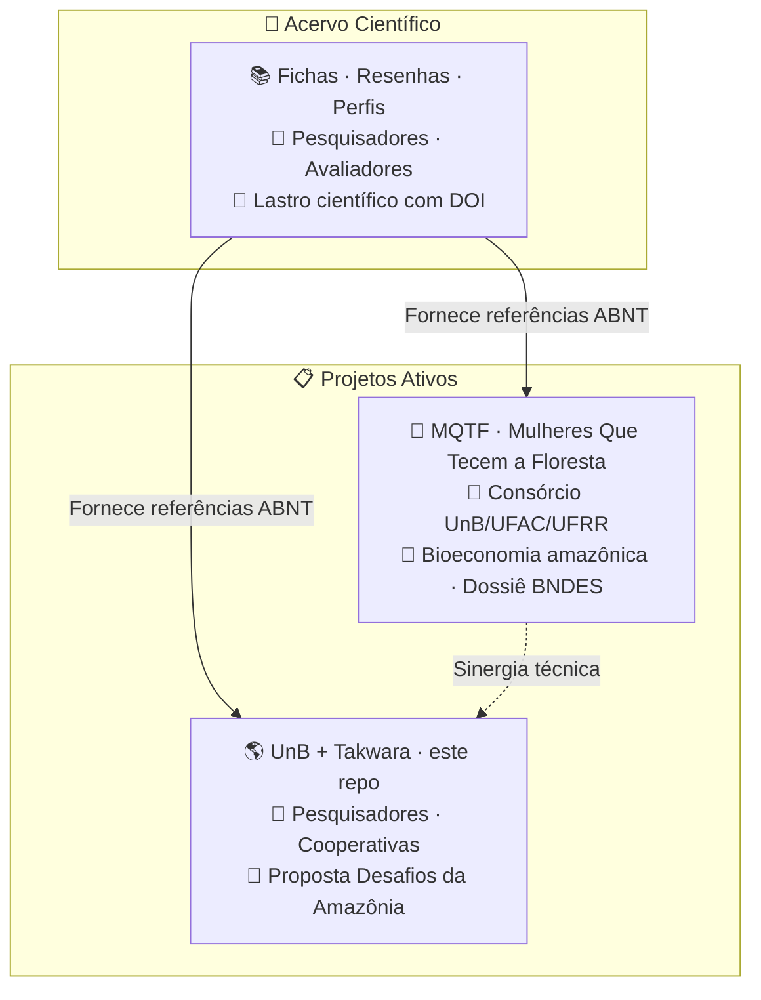

# 🌿 UnB + Tecnologia Takwara — Desafios da Amazônia

> ⚠️ **Compartilhamento seletivo** — Este repositório não é de acesso público irrestrito. Recomendamos o compartilhamento apenas com pessoas que tenham vínculo direto com o propósito: pesquisadores parceiros, cooperativas, avaliadores de editais e orientadores. A entrada de novos membros no ecossistema se dá exclusivamente por conexão com um projeto irmão ativo — não por convite aberto.
>
> 🎋 **Acelerador de resultados, não vitrine** — Como o bambu, que não cresce isolado mas em rede de rizomas subterrâneos, cada repositório deste ecossistema só ganha sentido quando vinculado a um projeto real. Não expomos conhecimento para validação externa — aceleramos quem está na ponta.
>
> Trabalhamos sob duas bússolas. As **7 Lições do Bambu** nos lembram que é preciso curvar sem quebrar, criar raízes profundas, cooperar em comunidade, crescer com foco, colecionar nós de aprendizado, permanecer ocos de certezas e buscar o bem comum. Os **7 Pilares de Edgar Morin** para a educação do futuro nos ancoram no pensamento complexo: o conhecimento só é pertinente quando enfrenta a incerteza, ensina a condição humana e se compromete com a ética.
>
> 🌱 **Este repositório** é a proposta da Rede UnB + Tecnologia Takwara para o Edital Desafios da Amazônia (Amazônia+10 / CONFAP / BNDES / Fundo Amazônia) — R$ 107 milhões em soluções para as cadeias produtivas da sociobioeconomia amazônica.

---

## 🌐 Site do Projeto

👉 **https://takwaratec.github.io/unb-desafios-amazonia-2026/**

---

## 📂 O que tem em cada pasta?

| Pasta | O que contém |
|---|---|
| `docs/` | **Documentos do projeto** — edital, proposta, rede, anexos |
| `docs/index.md` | 🎯 **Raio-X de enquadramento** — análise completa para compartilhar com parceiros |
| `docs/edital/` | Ficha do edital, regulamento transcrito, formulário espelho |
| `docs/proposta/` | Rascunho da proposta, orçamento, cronograma |
| `docs/rede/` | Membros da Rede — ICTs, OSPs, pesquisadores |
| `docs/anexos-obrigatorios/` | Cartas de anuência, declarações |
| `.agents/scripts/` | Scripts de apoio — triagem, revisão, expansão de proposta |
| `TRIAGEM-BRUTA/` | Material original NÃO versionado (áudios, PDFs, conversas) |

---

## 📋 Edital Ativo

| Campo | Valor |
|---|---|
| **Programa** | 1ª Chamada do Programa Desafios da Amazônia |
| **Realização** | CONFAP + BNDES + Fundo Amazônia + FAPs |
| **Valor total** | R$ 107,1 milhões |
| **Valor por projeto** | R$ 6M a R$ 10M |
| **Cadeias** | Açaí, Castanha-da-Amazônia, Cacau, Babaçu, Pesca |
| **Pré-proposta** | Até **01/09/2026** |
| **Proposta final** | Até 08/12/2026 |
| **Submissão** | https://sig.confap.org.br/ |
| 🔗 **Edital completo** | https://www.amazoniamaisdez.org.br/chamadas-abertas |

### Quem pode participar?

| Papel | Requisito |
|---|---|
| **ICT Executora** | Sediada na Amazônia Legal, pública ou privada sem fins lucrativos |
| **ICT Co-Executora** | Sediada na Amazônia Legal, **em estado diferente** da Executora |
| **OSP** | Cooperativa ou associação, 2+ anos de constituição, sediada na Amazônia Legal |

---

## 🔗 Ecossistema de repositórios

| Repositório | O que é | Para quem | Relação com os irmãos |
|---|---|---|---|
| 📚 **Acervo Científico** | Memória técnica: fichas, resenhas, estados da arte com DOI | Pesquisadores, avaliadores de editais, orientadores | Fornece lastro científico para todos os projetos |
| 🌿 **MQTF** (Mulheres-Tecem-Amazonia) | Consórcio UnB/UFAC/UFRR — bioeconomia amazônica, dossiê BNDES, série Técnica | Pesquisadores, comunidades amazônicas, financiadores | Recebe lastro do Acervo; sinergia técnica com este projeto |
| 🌎 **UnB + Takwara** (este repo) | Proposta Desafios da Amazônia — R$ 6-10M em soluções para cadeias socioprodutivas | Avaliadores BNDES/CONFAP, Profa Tania (UnB), parceiros | Recebe lastro do Acervo; diálogo técnico com MQTF |

---

## 👥 Parceiros

| Pessoa | Papel | Instituição |
|---|---|---|
| **Profa. Dra. Tânia** | Pesquisadora Responsável | UnB |
| **Pesquisador(a) a definir** | ICT Executora (Amazônia Legal) | UFAC / UFPA / UFAM |
| **Pesquisador(a) a definir** | ICT Co-Executora (outro estado) | UFRR / UNIR |
| **Organização a definir** | OSP parceira | Cooperativa/Associação na Amazônia Legal |
| **Fabio Takwara** | Desenvolvedor IA, tecnologias sociais | Tecnologia Takwara |

---

## 📚 Acervo científico

Pesquisas, fichas técnicas e referenciais para embasar a proposta:
👉 **https://takwaratec.github.io/Analises-e-escrita-cientifica/**

> O Acervo Científico é a **fonte única de referências** para todos os projetos do ecossistema. Nenhuma citação deve vir de fontes paralelas.

---

## 📲 Como baixar este repositório

Botão verde **Code** → **Download ZIP** no GitHub.  
Ou acesse os arquivos .md direto no navegador — abrem formatados automaticamente.

---

*Atualizado: 28/06/2026 · Repositório irmão: MQTF (Mulheres-Tecem-Amazonia) · Tecnologia Takwara*
