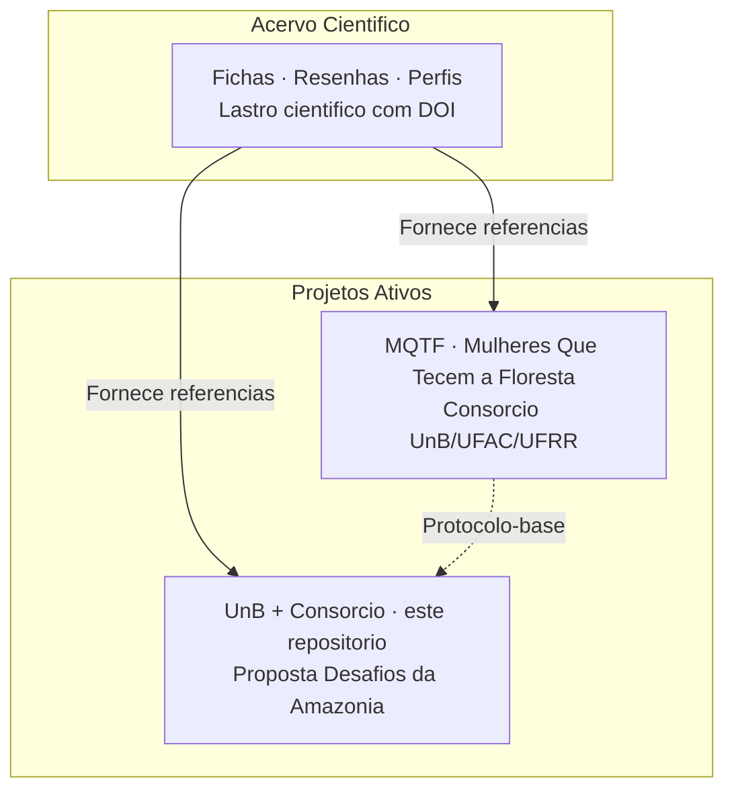

# Proposta UnB + Consórcio — Programa Desafios da Amazônia

> ⚠️ **Compartilhamento seletivo** — O acesso a este repositório é restrito a pessoas com vínculo direto com o propósito: pesquisadores parceiros, Instituições Científicas e Tecnológicas (ICTs), Organizações Socioprodutivas (OSPs), avaliadores de editais e orientadores. A entrada de novos membros se dá exclusivamente por conexão com um projeto irmão ativo.
>
> 🎋 Este ecossistema opera sob duas bússolas complementares. As **7 Lições do Bambu** — curvar sem quebrar, criar raízes profundas, cooperar em comunidade, crescer com foco, colecionar nós de aprendizado, permanecer ocos de certezas e buscar o bem comum. Os **7 Pilares de Edgar Morin** para a educação do futuro — o conhecimento pertinente, a condição humana, a identidade terrena, a incerteza, a compreensão, a ética e o enfrentamento dos paradoxos.
>
> Este repositório consolida a proposta da Rede de Pesquisa e Inovação para o **Edital Desafios da Amazônia** (Amazônia+10 / CONFAP / BNDES / Fundo Amazônia) — R$ 107 milhões em soluções para cadeias produtivas da sociobioeconomia amazônica.

---

## 1. Modelo de Colaboração — Partilha de Trabalho

O sistema de partilha e colaboração nos projetos segue a seguinte divisão:

| Ator | Atribuição |
|---|---|
| **Pesquisadores parceiros** (ICTs, OSPs) | Fornecem conhecimento técnico-científico, dados de campo, artigos de referência. Podem gravar **áudios** explicativos (não vídeos) e enviar documentos |
| **Staff de modelagem e escrita** | Transcreve, estrutura, redige, formata, pesquisa referências e consolida documentos |
| **Revisão** | Pesquisadores revisam e aprovam o material produzido |

### Orientações para envio de material:

1. **Identificar-se** no início de cada áudio: "Pesquisador [nome], ref. Desafios da Amazônia"
2. **Nomear o projeto** — mencionar "Desafios da Amazônia" para correta alocação na triagem
3. **Um assunto por áudio** — temas separados facilitam o processamento
4. **Acompanhar documentos** — enviar PDF/artigo com indicação do que extrair

> 📥 O material enviado é processado e alocado na TRIAGEM-BRUTA da frente correspondente. Todo o conteúdo é versionado em .md, com atribuição ao autor original.

---

## 2. Protocolo-base do MQTF

Este projeto adota o protocolo-base de governança estabelecido pelo MQTF (Mulheres Que Tecem a Floresta), que inclui diretrizes para:
- Consentimento e anuência das comunidades parceiras
- Proteção de conhecimentos tradicionais
- Soberania de dados territoriais
- Transparência na partilha de ativos

**Sem a observância deste protocolo, trabalhos de campo não podem ser iniciados — apenas rascunhos internos de proposta.**

Referência: documentação de governança do repositório MQTF.

---

## 3. Dados do Edital

| Campo | Valor |
|---|---|
| **Programa** | 1ª Chamada do Programa Desafios da Amazônia |
| **Realização** | CONFAP + BNDES + Fundo Amazônia + FAPs |
| **Valor total** | R$ 107,1 milhões |
| **Valor por projeto** | R$ 6M a R$ 10M |
| **Cadeias** | Açaí, Castanha-da-Amazônia, Cacau, Babaçu, Pesca |
| **Pré-proposta** | Até **01/09/2026** via SIGCONFAP |
| **Proposta final** | Até 08/12/2026 |
| **Edital completo** | https://www.amazoniamaisdez.org.br/chamadas-abertas |

### Elegibilidade

| Papel | Requisito |
|---|---|
| **ICT Executora** | Sediada na Amazônia Legal, pública ou privada sem fins lucrativos |
| **ICT Co-Executora** | Sediada na Amazônia Legal, **em estado diferente** da Executora |
| **OSP** | Cooperativa ou associação, 2+ anos, sediada na Amazônia Legal |
| **PR (Pesquisador Responsável)** | Doutor, vínculo formal com a ICT Executora |

---

## 4. Ecossistema de repositórios

| Repositório | O que é | Para quem |
|---|---|---|
| **Acervo Científico** | Memória técnica: fichas, resenhas, estados da arte com DOI rastreável | Pesquisadores, avaliadores de editais |
| **MQTF** (Mulheres-Tecem-Amazonia) | Consórcio UnB/UFAC/UFRR — dossiê BNDES, série técnica, bioeconomia | Pesquisadores, comunidades amazônicas |
| **UnB + Consórcio** (este repo) | Proposta Desafios da Amazônia — R$ 6-10M | Avaliadores BNDES/CONFAP, parceiros |

> O Acervo Científico é a fonte única de referências para todos os projetos do ecossistema. Exemplo ilustrativo do modelo de referenciamento: as ferramentas **TerImpact Ex-Ante** e **AgroRadarEval** (Daniela Maciel, Embrapa) estão fichadas no Acervo e associadas aos projetos do ECOSALA, demonstrando como a produção acadêmica se vincula às iniciativas em desenvolvimento. O mesmo modelo será aplicado ao MQTF e a este projeto.

---

## 5. UnB no Acervo Científico

Será criada uma seção específica para a UnB no Acervo Científico (`Analises-e-escrita-cientifica`), análoga à já existente para o ECOSALA, contendo:
- Perfil dos pesquisadores envolvidos
- Fichas técnicas da produção acadêmica relacionada
- Projetos em desenvolvimento

---

## 6. Parceiros

| Pessoa | Papel | Instituição | Situação |
|---|---|---|---|
| **Profa. Dra. Tânia** | Pesquisadora Responsável | UnB | Confirmada |
| **ICT Executora** | A definir | Amazônia Legal | Em articulação |
| **ICT Co-Executora** | A definir (outro estado) | Amazônia Legal | Em articulação |
| **OSP** | A definir | Amazônia Legal | Em articulação |

---

## 7. Acervo científico

👉 **https://takwaratec.github.io/Analises-e-escrita-cientifica/**

O Acervo é a fonte única de referências. Conteúdo do MQTF ainda não fichado será progressivamente incorporado seguindo o método Cavichioli (2025) — 8 seções obrigatórias.

---

*Atualizado: 28/06/2026 · Repositório irmão: MQTF · Protocolo-base: documentação de governança MQTF*
