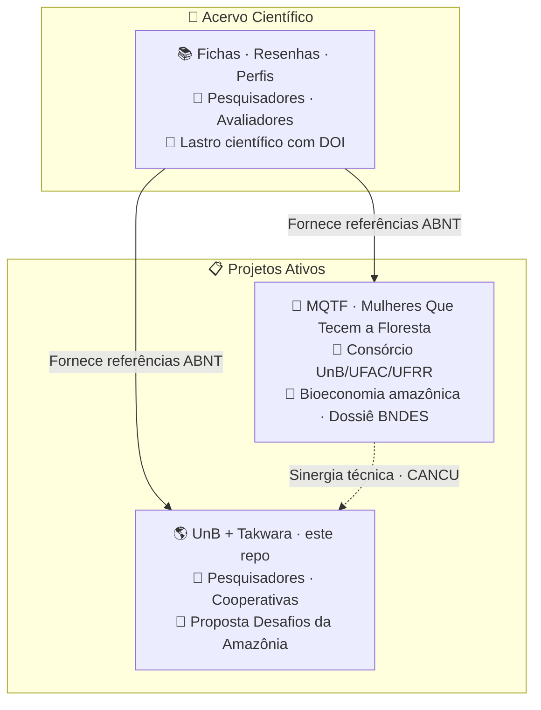

# 🌿 UnB + Tecnologia Takwara — Desafios da Amazônia

> ⚠️ **Compartilhamento seletivo** — Este repositório não é de acesso público irrestrito. Recomendamos o compartilhamento apenas com pessoas que tenham vínculo direto com o propósito: pesquisadores parceiros, cooperativas, avaliadores de editais e orientadores. A entrada de novos membros no ecossistema se dá exclusivamente por conexão com um projeto irmão ativo — não por convite aberto.
>
> 🎋 **Acelerador de resultados, não vitrine** — Como o bambu, que não cresce isolado mas em rede de rizomas subterrâneos, cada repositório deste ecossistema só ganha sentido quando vinculado a um projeto real. Não expomos conhecimento para validação externa — aceleramos quem está na ponta.
>
> Trabalhamos sob duas bússolas. As **7 Lições do Bambu** nos lembram que é preciso curvar sem quebrar, criar raízes profundas, cooperar em comunidade, crescer com foco, colecionar nós de aprendizado, permanecer ocos de certezas e buscar o bem comum. Os **7 Pilares de Edgar Morin** para a educação do futuro nos ancoram no pensamento complexo: o conhecimento só é pertinente quando enfrenta a incerteza, ensina a condição humana e se compromete com a ética.
>
> 🌱 **Este repositório** é a proposta da Rede UnB + Tecnologia Takwara para o Edital Desafios da Amazônia (Amazônia+10 / CONFAP / BNDES / Fundo Amazônia) — R$ 107 milhões em soluções para as cadeias produtivas da sociobioeconomia amazônica.

---

## 🎯 Para a Profa Tânia e Parceiros — Como Esta Parceria Funciona

### O que nós (Fabio + Hermes) fazemos na "cozinha"

Nossa função é **desafogar os doutores do serviço pesado** de escrita, formatação, pesquisa e consolidação. O fluxo é simples:

| Vocês (parceiros acadêmicos) | Nós (cozinha) |
|---|---|
| Gravam **vídeos** ou **áudios** explicando o conteúdo | Transcrevemos, estruturamos e transformamos em texto de proposta |
| Enviam **documentos de referência** (PDFs, artigos, relatórios) | Extraímos o conteúdo, criamos fichas no Acervo Científico |
| Compartilham **dados técnicos** (coordenadas, espécies, comunidades) | Incorporamos na proposta com atribuição correta |
| Revisam e **aprovam** o que produzimos | Ajustamos conforme o feedback |

### 📌 Regras para enviar material (para não misturar assuntos)

1. **Identifique-se sempre** — diga seu nome no início de cada áudio/vídeo. Áudios podem se misturar na pasta de triagem.
2. **Nomeie o projeto** — mencione "Desafios da Amazônia" ou o nome do edital para que eu saiba em qual frente alocar.
3. **Um assunto por vez** — se são temas diferentes (ex: orçamento e metodologia), grava áudios separados.
4. **Documentos de referência** — mande o PDF/link e diga o que espera que eu extraia dele.

> 📥 **Para enviar material:** basta mandar no chat (WhatsApp/Telegram) ou no e-mail. Eu processo e aloco na TRIAGEM-BRUTA da frente correta.

### ⛔ Salvaguardas de Cancún (CANCU) — Protocolo-base do MQTF

**Sem as Salvaguardas de Cancún (REDD+), os trabalhos não podem ter início, exceto como rascunho interno.** Isso não é burocracia — é a base de governança que garante:

- Soberania dos dados territoriais
- Consentimento Prévio, Livre e Informado (CPLI) das comunidades
- Proteção dos conhecimentos tradicionais
- Transparência e rastreabilidade

O protocolo completo está no MQTF: `GOV_PROTOCOLO_SEGURANCA_CANCUN.md`
Qualquer proposta deste projeto deve referenciar e respeitar este protocolo.

---

## 🌐 Site do Projeto

👉 **https://takwaratec.github.io/unb-desafios-amazonia-2026/**

---

## 📂 Estrutura

| Pasta | O que contém |
|---|---|
| `docs/` | **Documentos do projeto** — edital, proposta, rede, anexos |
| `docs/index.md` | 🎯 **Raio-X de enquadramento** — análise completa edital vs. tecnologias |
| `docs/edital/` | Ficha do edital, regulamento transcrito |
| `docs/proposta/` | Rascunho da proposta, orçamento, cronograma |
| `docs/rede/` | Membros da Rede — ICTs, OSPs, pesquisadores |
| `docs/anexos-obrigatorios/` | Cartas de anuência, declarações |
| `docs/protocolo-colaboradores.md` | 📋 **Protocolo de relacionamento com colaboradores** |
| `.agents/scripts/` | Scripts portados do MQTF (triagem, revisão, expansão) |
| `TRIAGEM-BRUTA/` | Material original NÃO versionado (áudios, PDFs, conversas) |

---

## 📋 Edital Ativo

| Campo | Valor |
|---|---|
| **Programa** | 1ª Chamada do Programa Desafios da Amazônia |
| **Realização** | CONFAP + BNDES + Fundo Amazônia + FAPs |
| **Valor total** | R$ 107,1 milhões |
| **Valor por projeto** | R$ 6M a R$ 10M |
| **Cadeias** | Açaí, Castanha-da-Amazônia, Cacau, Babaçu, Pesca |
| **Pré-proposta** | Até **01/09/2026** |
| **Proposta final** | Até 08/12/2026 |
| **Submissão** | https://sig.confap.org.br/ |
| 🔗 **Edital completo** | https://www.amazoniamaisdez.org.br/chamadas-abertas |

---

## 🔗 Ecossistema de repositórios

| Repositório | O que é | Para quem | Relação com os irmãos |
|---|---|---|---|
| 📚 **Acervo Científico** | Memória técnica: fichas, resenhas, estados da arte com DOI | Pesquisadores, avaliadores | Fornece lastro científico para todos os projetos |
| 🌿 **MQTF** | Consórcio UnB/UFAC/UFRR — bioeconomia, dossiê BNDES | Pesquisadores, comunidades | Recebe lastro do Acervo; fornece protocolo CANCU |
| 🌎 **UnB + Takwara** (este repo) | Proposta Desafios da Amazônia | Avaliadores, Profa Tânia, parceiros | Recebe lastro do Acervo; referência CANCU do MQTF |

---

## 👥 Parceiros (em mapeamento)

| Pessoa | Papel | Instituição | Situação |
|---|---|---|---|
| **Profa. Dra. Tânia** | Pesquisadora Responsável | UnB | ✅ Confirmada |
| **ICT Executora** | A definir (UFAC? UFPA? UFAM?) | Amazônia Legal | 🔍 Mapeando |
| **ICT Co-Executora** | A definir (outro estado) | Amazônia Legal | 🔍 Mapeando |
| **OSP** | A definir (cooperativa/associação) | Amazônia Legal | 🔍 Mapeando |
| **Fabio Takwara** | Desenvolvedor IA, tecnologias sociais | Tecnologia Takwara | ✅ Cozinha |

> **Nota:** UFAC tem expertise em bambu — os pares específicos que vão se relacionar com este projeto ainda não foram identificados. Profa Tânia está em articulação.

---

## 📚 Acervo científico

Pesquisas, fichas técnicas e referenciais para embasar a proposta:
👉 **https://takwaratec.github.io/Analises-e-escrita-cientifica/**

> O Acervo é a **fonte única de referências**. Conteúdo do MQTF ainda não fichado será fichado aqui.

---

*Atualizado: 28/06/2026 · Repositório irmão: MQTF · Protocolo-base: Salvaguardas de Cancún (CANCU) · Tecnologia Takwara*
